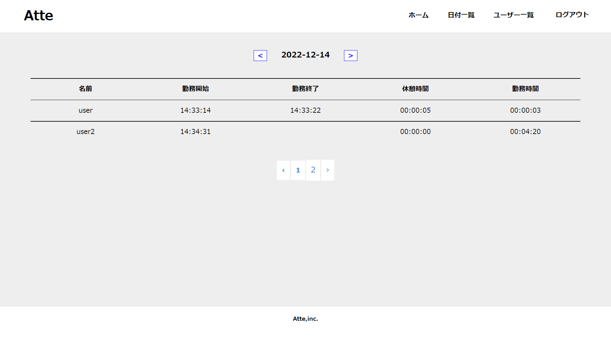
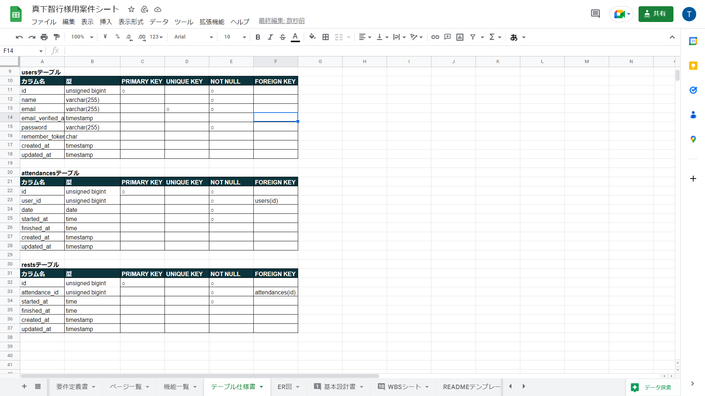
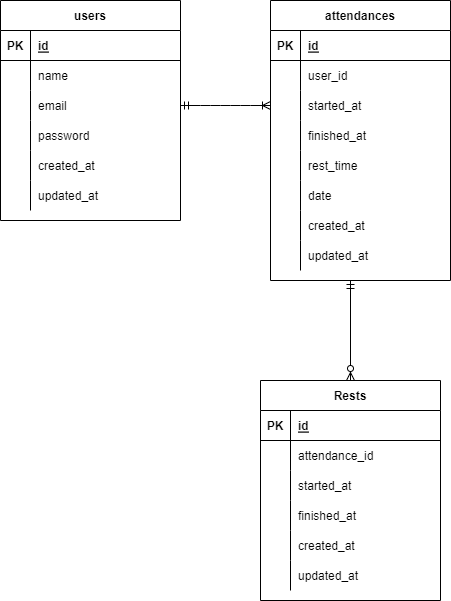

# アプリケーション名
atte

概要説明（どんなアプリか）

atteは勤怠管理システムです。勤務開始、勤務終了時間及び、休憩開始、休憩終了時間の打刻が可能です。また、勤怠データを日付ごとに閲覧することが可能です。

< --- トップ画面の画像 ---- >

## 作成した目的

概要説明（なんで作成したか）

このアプリは企業の人事評価のために作成しました。

## 機能一覧
- 勤務開始・終了時間及び休憩開始・終了時間の打刻
- 日付一覧を閲覧する
- ログイン、ログアウトする
- ユーザー登録する
- ユーザー一覧ページを閲覧する
- ユーザーページを閲覧する

## 使用技術（実行環境）
- Laravel　8.83.22
- PHP 8.1.5

## テーブル設計
< --- 作成したテーブル設計の画像 ---- >

## ER図
< --- 作成したER図の画像 ---- >

# 環境構築

mysql -u root -p

create database attendancedb;

composer require "laravel/breeze=1.9.0" --dev

php artisan breeze:install

npm install

npm run dev

php artisan make:controller AttendanceController

php artisan make:controller RestController

php artisan make:controller TestMailController

php artisan make:mail TestMail

php artisan make:model Attendance -m

php artisan make:model Rest -m

php artisan migrate

php artisan make:seeder AttendancesTableSeeder

php artisan make:seeder RestsTableSeeder

php artisan db:seed

## 他に記載することがあれば記述する

メール認証システムにmailtrapを利用しているのでmailtrapの登録が必要です。
envファイルは別途お渡しします。

使用OSはWindows10 64bitです。